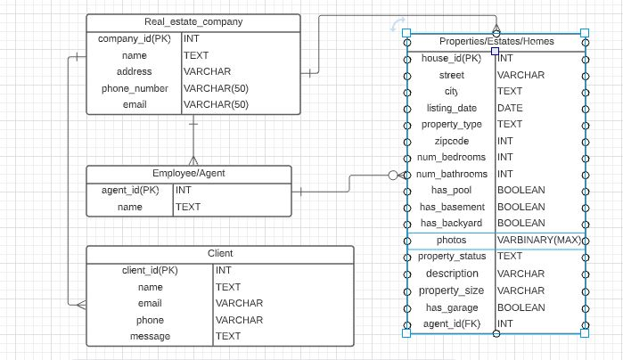

# SpringBoot Real Estate Service

#Purpose
----------------------------------------------------------------------------

This projects is a Real estate management application to help Brokers/ And real estate agents manage their property listings and assist their clients. The application allows real estate professionals to add new properties to the system with a description of the properties characteristics.The broker can add new agents and assign them properties to manage. Home buyers will be able to search for properties on a website and leave their contact details.

#Technologies Used
----------------------------------------------------------------------------------
----------------------------------------------------------------------------------
- Intellij

- Spring Boot

- Java

- Maven

- LucidChart 

- Postman 

- PostgreSQL

- Miro

#Development Process
------------------------------------------------------------------------------------
------------------------------------------------------------------------------------
1.) I began by creating a ER diagram on Lucid Chart

2.)I made an architecture of the application on Miro app

#User Stories
-------------------------------------------------------------------------------------
-------------------------------------------------------------------------------------

- As a user, I want to be able to add new properties to our system, so that potential clients can view them on our website.

- As a user, I want to be able to update or delete properties.

- As a user, I want to be able to see the customers who have filled our "contact me" form, because I want to be able to contact them and sell a house to them

- As a user, I want to be able to add new real estate agents to our database or delete/update agents.

- As a user, I want to be able to assign houses to agents to be in charge of selling those houses

- As a user, I want to be able to add new offices, should I decide to open more branches

- As a user, I want my potential clients to be able to search for properties by type, zip, neighborhood etc.

