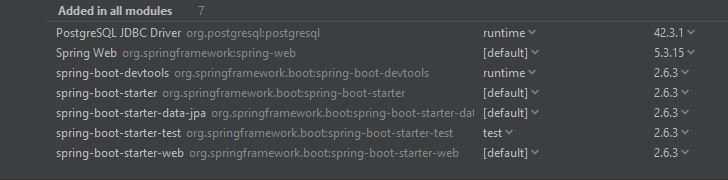
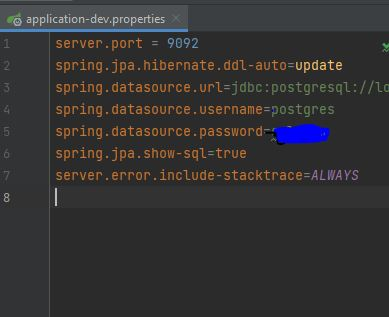
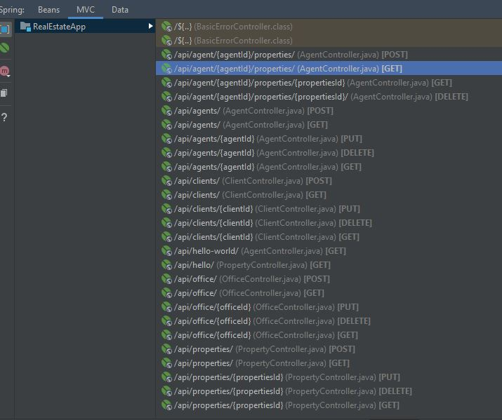

# SpringBoot Real Estate Service

#Purpose
----------------------------------------------------------------------------

This project is a Real estate management application to help Brokers and real estate agents manage their property listings. The application allows real estate professionals to add new properties to the system with a description of the properties and their characteristics.New agents can be added and all agents can be assigned  properties to manage. Home buyers will be able to search for properties on the brokerage's website and leave their contact details on the form. If the Broker decides to open a new branch/office in a new location they can add a new office to the database.

#Technologies Used
----------------------------------------------------------------------------------
----------------------------------------------------------------------------------
- Intellij

- Spring Boot

- Java

- Maven

- LucidChart 

- Postman 

- PostgreSQL

- Miro

#Model View Controller System Design (MVC):
----------------

This project was built using the MVC design pattern utilizing a Model, View,and Controller class to seperate business concerns. The project consists of
- 4 models:  Agent, Client, Properties, and RealEstateOffice
- 4 service layers: AgentService, PropertyService, OfficeService, and ClientService
- 4 Repository Interfaces : AgentRepository, PropertyRepository, OfficeRepository, ClientRepository
- 4 controllers: AgentController, PropertyController, OfficeController, and ClientController

#Development Process
------------------------------------------------------------------------------------
------------------------------------------------------------------------------------
1.) I began by creating a ER diagram on Lucid Chart

2.)I made an architecture of the application on Miro app to visualize how I'd make my MVC, contrary to the image, I decided later on to add a service, controller, and 
repository interface for the real estate office itself.

3.) Next I brainstormed ideas for the application by thinking of the type of tasks an agent or brokerage would perform, then I wrote user stories.

4.) I kept a to do list in my notebook of requirements I needed to fulfill, then wrote out tasks and put a deadline for each task to stay on track.

#User Stories
-------------------------------------------------------------------------------------
-------------------------------------------------------------------------------------

- As a user, I want to be able to add new properties to our system, so that potential clients can view them on our website.

- As a user, I want to be able to update or delete properties.

- As a user, I want to be able to see the customers who have filled our "contact me" form, because I want to be able to contact them and sell a house to them

- As a user, I want to be able to add new real estate agents to our database or delete/update agents.

- As a user, I want to be able to assign houses to agents to be in charge of selling those houses

- As a user, I want to be able to add new offices, should I decide to open more branches

- As a user, I want my potential clients to be able to search for properties by type, zip, neighborhood etc.

# Installation and Dependencies.
--------------------------------------------
I installed spring boot starter web dependencies in pom.xml

I also created a database called realestate in postgreSQL and connected it to spring boot by installing a starter package in pom.xml :
          <dependency>
            <groupId>org.postgresql</groupId>
            <artifactId>postgresql</artifactId>
            <scope>runtime</scope>
           </dependency>
           
           
I also added data source specifications in application-dev.properties to connect the database in PostgreSql
 
 

#API End points used:
-----------------------------------------

There were a total of 24 API endpoints created in this project. 

#Challenges and Wins:
-------------------------------------------
I wanted to be able to unassign a property that was assigned to an agent. Initially, the first method I wrote to do, so was actually
making it so that the property was deleted permanently from the agent and from the table of properties. I wanted to only delete the property
from the agent table but still have it exist in the property table. This would be an important feature in the case that an agent is taking vacation time or is taking maternity leave, for example. In a situation like that it would be necessary to unassign the property, to be able to assign it to another agent if needed. I saught assistance with this issue. The code was refactored an was finally able to remove the agent id from the property table but the property was still showing in the agent's data. In the end the solution was to use .remove instead of .delete then andthen using  property.setAgent(null) to unassign the property from the agent. The end result was being able to remove properties from agents but not have them permanently deleted.

